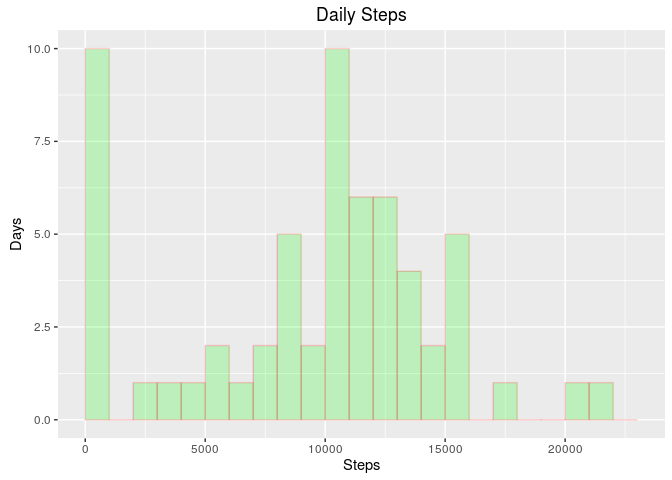
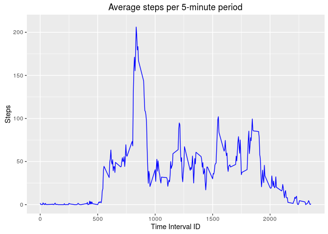
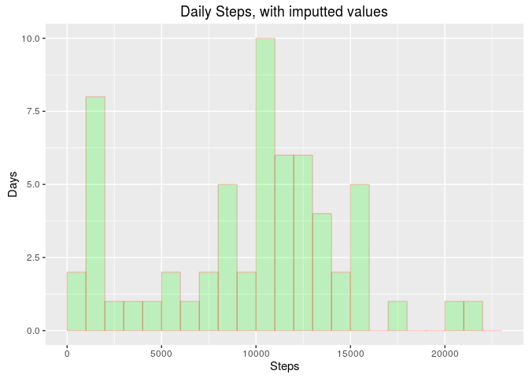
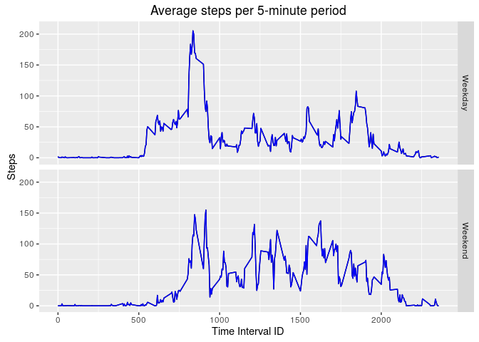

# Reproducible Research: Peer Assessment 1

# Introduction
This report makes use of data from a personal activity monitoring
device. This device collects data at 5 minute intervals through out the
day. The data consists of two months of data from an anonymous
individual collected during the months of October and November, 2012
and include the number of steps taken in 5 minute intervals each day.

## Data

The data used for this report can be downloaded from the web
site:

* Dataset: [Activity monitoring data](https://d396qusza40orc.cloudfront.net/repdata%2Fdata%2Factivity.zip) [52K]

The variables included in this dataset are:

* **steps**: Number of steps taking in a 5-minute interval (missing
    values are coded as `NA`)

* **date**: The date on which the measurement was taken in YYYY-MM-DD
    format

* **interval**: Identifier for the 5-minute interval in which
    measurement was taken

The dataset is stored in a comma-separated-value (CSV) file and there
are a total of 17,568 observations in this
dataset.

## Loading and preprocessing the data
Our script uses *data.table* and *ggplot2* libraries that are loaded before
reading the data.


```r
library(data.table)
library(ggplot2)
df <- read.csv(unz("repdata-data-activity.zip", "activity.csv"))
```

## What is mean total number of steps taken per day?
Before plotting a histogram, we find the total steps each day, ignoring missing values of the *steps* variable.

```r
daily <- aggregate(df$steps, by=list(df$date), FUN=sum, na.rm=TRUE)
ggplot(data=daily, aes(x)) + 
  geom_histogram(breaks=seq(0, 23000, by = 1000), 
                 col="red", 
                 fill="green", 
                 alpha = .2) + 
  labs(title="Daily Steps") +
  labs(x="Steps", y="Days") + ylim(as.integer(c(0,10)))
```



The mean number of steps taken per day is **9354**.
The median number of steps taken per day is **10395**.

## What is the average daily activity pattern?
We compute the average number of steps for each 5-minute time interval for
the **61** dates in the dataset.


```r
steps <- aggregate(df$steps, by=list(time=df$interval), FUN=mean, na.rm=TRUE)
ggplot(data=steps, aes(time,x)) + 
  geom_line(col="blue") + 
  labs(title="Average steps per 5-minute period") +
  labs(x="Time Interval ID", y="Steps") + ylim(as.integer(c(0,210)))
```



```r
maxsteps <- max(steps$x)
maxtime <- steps[which(steps$x==maxsteps),1]
hour <- floor(maxtime/100)
minute <- floor((maxtime - 100*hour))
time<-substr(strptime(paste(hour, minute, sep=":"), "%H:%M"), 12, 16)
```

The maximum average steps per 5-minute period was **206** which occurs
at **08:35** (24 hour clock).

## Imputing missing values
There are **2304** missing values of the *steps* variable.
We replace missing values with the median for that 5-minute interval across all days.


```r
medians <- sapply(df$interval, function(x){median(df[df$interval==x,1], na.rm=TRUE)})
df1 <- data.frame(steps=df$steps, date=df$date, interval=df$interval)
df1[is.na(df$steps),1] <- medians[is.na(df$steps)]
daily1 <- aggregate(df1$steps, by=list(df1$date), FUN=sum, na.rm=TRUE)
ggplot(data=daily1, aes(x)) + 
  geom_histogram(breaks=seq(0, 23000, by = 1000), 
                 col="red",
                 fill="green", 
                 alpha = .2) + 
  labs(title="Daily Steps, with imputted values") +
  labs(x="Steps", y="Days") + ylim(as.integer(c(0,10)))
```



With imputted data, the mean number of steps taken per day is **9503**
(versus *9354*).
The median number of steps taken per day does not change (**10395**).

## Are there differences in activity patterns between weekdays and weekends?
We create an R factor variable *weekday* with factor values *Weekday* and *Weekend*
and plot the average number of steps by time interval for each factor.


```r
df1$weekday <- factor((weekdays(as.Date(df1$date)) %in% c("Saturday", "Sunday")),
                      levels=c(FALSE, TRUE), labels=c('Weekday', 'Weekend'))

steps1 <- aggregate(df1$steps, by=list(Interval=df1$interval, day=df1$weekday), FUN=mean, na.rm=TRUE)
ggplot(data=steps1, aes(Interval,x)) + geom_line() + facet_grid(day~.) +
  geom_line(col="blue") + 
  labs(title="Average steps per 5-minute period") +
  labs(x="Time Interval ID", y="Steps") + ylim(as.integer(c(0,210)))
```


